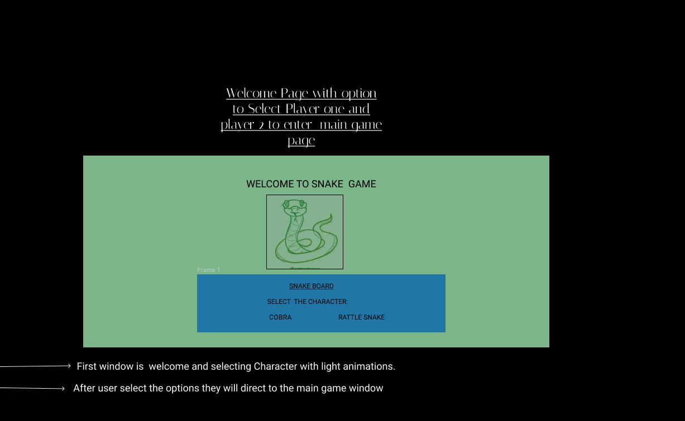
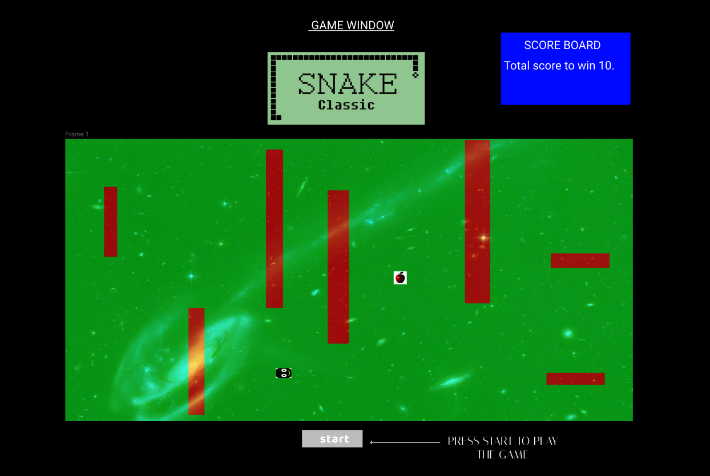

<h1>SNAKE BOARD</H1>

<H2> <u>OVERVIEW</u></H2>
This Project is based on building a game by using HTML,CSS and JAVASCRIPT. I always wanted to create a game which i use to play when i was a little kid. Snake board is very fun game and was so famous back in 90's.
 
<h2><u>GAME RULES</u></h2> 
 Snake game has no hard rules to offer. The rule of the game are very simple and easy. Please see below the game rules and how to play it.
 <ul>
 <li>Select option between snake character on your first display window.
 </li>
  
<li>After selecting the character you will be in your second window which has a game board and your live score board.
 </li>
  
 <li>To start a game press start at the bottom middle of the game board
 </li>
  
 <li>Main game window has a game snake board and a live score board that counts a score everytime snake eat the apple.
 </li>
  
 <li>You have your snake head and every time you eat the apple which will appear randomly on the board snake body will increment by +1 highest score 10.
 </li>
  
 <li>You snake speed increase every 2 apple has been eaten. 
 </li>
  
 <li>Snake has obstracle in the board as a red rectangle shape if snake touch the red bricks GAME is OVER.
 </li>
  
 <li>If snake touches the wall of the board GAME is OVER or touches its own body GAME is OVER </li>
  
 <li>Everytime Snake eat the apple Score board will generate the live score until 10 points. </li>
  
 <li>If snake reaches 8 points and loss player will get one more chance to start from the beginning</li>
  
 <li>The word Snake Classic located at the top of the board will generate different color in every time interval</li>
 
 </ul>

 <h2>WIREFRAME</h2>
1.

 
2.

 

<H2><u>USER STORIES</u></H2>

<ul>
<li>
(As a user) I want to select the character from my first displayed window.
</li>
 
<li>After selecting the character I will enter the main game window and press start to play the game</li>
 
<li>I will try to eat the apple which will randomly appear in the game board and try not to bump in the wall or obstracals.
</li>
 
<li>I will try to score to score more until i hit 10 points to win .
</li>
 
<li>I would like to see the live score board updated everytime i eat the apple.
</li>
 
<li> When i finish my game as a user i want player z to start the game and compare the end score for winner.</li>
</ul>

<h2><u>MVP CHECKLIST</u></h2>
<ul>
<li>
Start tracking - who eat the most apple 
</li>
 
<li>I want a history log that keeps track of all the games played</li>
 
<li>
I want fancy styling and animations when ever snake eat the apple or bump on the wall or obstracel on away.
</li>
 
</ul>

<h2><u>STRETCH GOAL</u></h2>

